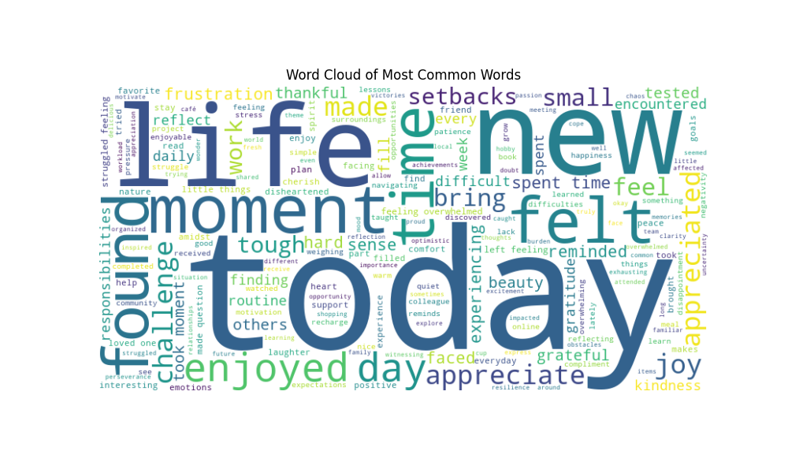
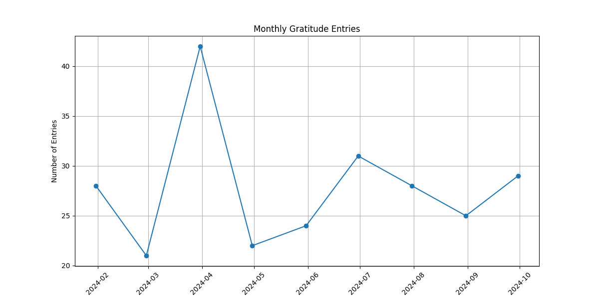

# Gratitude Journal Data Analysis 🌱

## Project Overview
This project analyzes gratitude journal entries to uncover common gratitude themes, sentiment (positive, neutral, negative), and patterns in word usage. Through text analysis, the project aims to provide insights into the emotions and expressions shared in journal entries, promoting mental well-being and positive reflection. The dataset currently uses synthetic data to simulate gratitude journal entries, with analysis performed using Python data analysis libraries.

### Features:
- **Data Generation**: Generates synthetic gratitude journal entries to simulate user data.
- **Exploratory Data Analysis (EDA)**: Visualizes trends, common gratitude themes, and word frequencies with word clouds and bar charts.
- **Sentiment Analysis**: Classifies journal entries as positive, neutral, or negative using the TextBlob library.

## Purpose of This Project
- **Promote Mental Well-Being**: By analyzing gratitude entries, the project seeks to identify how expressing gratitude affects happiness and mental health. It encourages individuals to reflect on the positive aspects of their lives.

- **Encourage Positive Interactions**: Understanding common themes in gratitude can promote more kindness and empathy within communities, fostering a supportive and caring environment.

- **Influence Policy and Programs**: Insights gained from this analysis may guide the development of programs and initiatives aimed at enhancing mental health and social well-being within communities.

## Getting Started

### Prerequisites
You need to have Python installed on your system along with the following Python libraries:
- `pandas`
- `numpy`
- `matplotlib`
- `textblob`
- `wordcloud`
- `faker`
- `nltk`

You can install the required libraries using:
```bash
pip install pandas numpy matplotlib textblob wordcloud faker nltk
```

This will output the word cloud, bar chart, and sentiment analysis of the gratitude journal entries.

## Example Output

Here are some sample visualizations that the project generates:

### Word Cloud:

This word cloud represents the most frequently mentioned words from the gratitude journal entries. The size of each word corresponds to its frequency of occurrence, allowing for a quick visual assessment of common themes. Larger words indicate more prevalent concepts, such as "today," "life," and "felt." This suggests that these elements are significant sources of gratitude for the journal participants. The visualization emphasizes the importance of appreciating today as a present moment and keeping a well-being to promote positive emotions.

### Bar Chart:

The bar chart displays the top 10 most common words found in gratitude journal entries, providing a clear representation of recurring gratitude themes. Each bar represents a word, with its height indicating the number of times it was mentioned across all entries. This analysis reveals that words related to today, new, and life dominate the list, highlighting the significance of these areas in individuals' lives. Such insights can encourage others to reflect on similar aspects in their own lives, promoting a culture of gratitude and appreciation within the community.


### Monthly Sentiment Breakdown:

The monthly sentiment breakdown allows us to track emotional well-being over time and understand how gratitude expressions are influenced by external factors. By examining these trends, we can develop initiatives or community programs tailored to support individuals during times when negative sentiments are more prevalent, while also celebrating periods of high positive sentiment.


The analysis also produces sentiment metrics (polarity and subjectivity) for each journal entry, which can be printed or saved to a CSV file for further exploration.


## Running the Project
Clone this repository:
```bash
git clone https://github.com/your-username/gratitude-journal-analysis.git
cd gratitude-journal-analysis
```

## Run the main analysis script:
```bash
python src/advanced_analysis.py
```

## Future Improvements

There are several directions in which this project could evolve:

- **Larger, Real-World Dataset**: Collecting anonymized gratitude entries from willing participants can enhance the depth of analysis and provide real-world insights.
- **Interactive Web Application**: Create an interactive web app where users can input their own gratitude entries and receive real-time analysis and feedback.
- **Time-Based Analysis**: Expand the project to track gratitude trends over time, allowing users to see how their expressions of gratitude evolve.
- **Advanced Sentiment Analysis**: Incorporate more sophisticated natural language processing (NLP) techniques to improve sentiment detection.

## Challenges

- **Privacy Considerations**: Real-world gratitude entries can be highly personal. If this project expands to include real data, careful attention will need to be given to anonymization and user privacy.
- **Sample Size**: The current analysis is based on synthetic data, which limits its real-world applicability. A larger, more diverse dataset would yield better insights.

## Conclusion

The Gratitude Journal Data Analysis project provides a structured way to explore gratitude expressions through data analysis. By analyzing gratitude themes and sentiments, it serves as a tool for personal reflection and community growth, promoting mental well-being and encouraging positive interactions.


